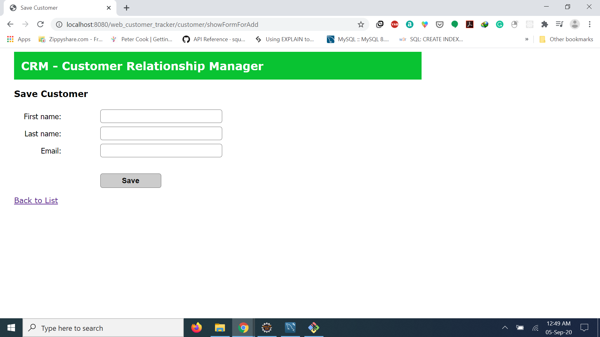
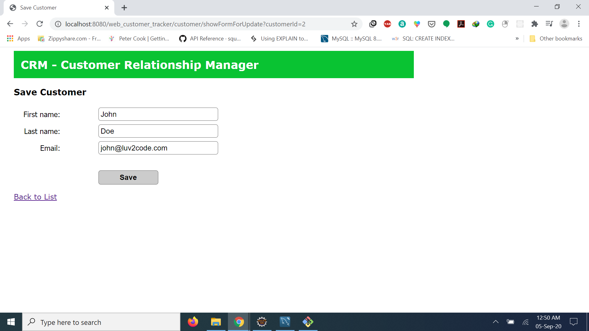

# SpringFrameworkDemo

A web application based on Spring MVC and hibernate. The web application is based on Customer Relationship Manager. Users can add,update,delete customer details. The changes are directly reflected on MYSQL database.
